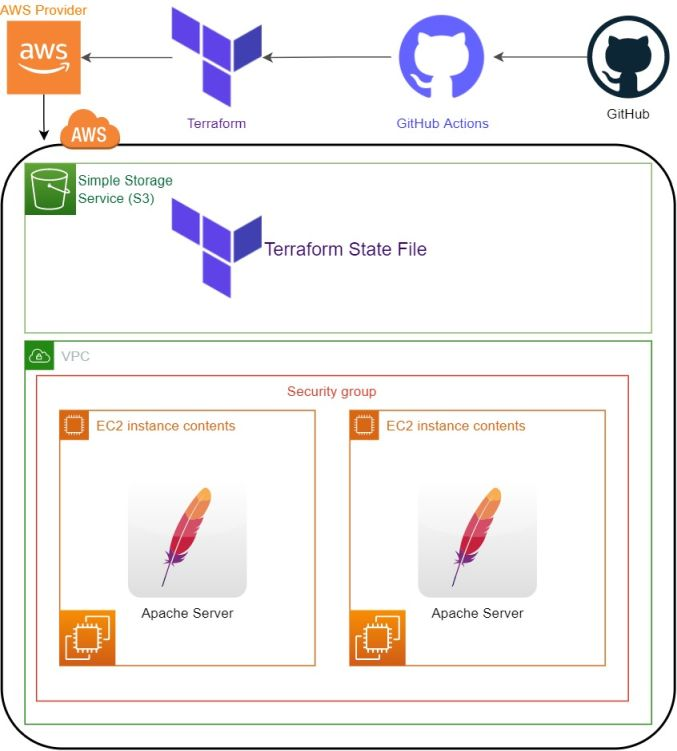

 

# Automate building Apache Servers with Terraform using GitHub Actions

## Project Architecture:

## Expected Outcome:

- Your company has recently started a project that aims to deploy a website in Apache Servers. You and your colleagues have started to work on the project. Your Teammate have developed the website and they need your help to build infrastructure for deploying the website.

- The workflow steps for you is like below:

  - Scope: Confirm what resources need to be created for the project.

  - Author: Create the configuration file in HCL based on the scoped parameters.

  - Initialize: Run `terraform init` in the project directory with the configuration files. This will download the correct provider plug-ins for the project.

  - Plan & Apply: Run `terraform plan` to verify creation process and then `terraform apply` to create the resources in your configuration files.

- You are, as a cloud engineer, requested to create the Apache servers AWS EC2 Instance using Terraform to showcase your project. To do that you need to;

  - Get the bash script code from GitHub repo of your team.

  - Create two Apache Servers using the `main.tf`.

    - Create two ec2 instance

      - ami: Amazon Linux 2 (use data source to fetch the ami)

      - instance type: t2.micro

      - ec2 tags : "Name: Terraform First Instance",
        "Name: Terraform Second Instance"

    - Install Apache server and start it. Write "Hello World" to the /var/www/html/index.html.

  - Create a Security Group and connect it to our instances.

    - inbound rules: open 22, 80 and 443 ports

    - outbound rules: open anywhere

  - Create a file name "public_ip.txt" and write your public ip's to the file.

  - Create a file name "private_ip.txt" and write your private ip's to the file.

  - Create an output in the terminal and display your public ip's when you create your infrastructure.

### At the end of the project, you will be covered the following topics;

- Terraform

- Bash scripting

- AWS EC2 Service

- AWS Security Group Configuration

- Git & Github for Version Control System

### At the end of the project, you will be able to;

- configure Terraform to use AWS resources.

- write Terraform configuration file.

- Initialize Terraform in the current folder.

- Create resources running `terraform plan` and `terraform apply` commands.

- improve bash scripting skills using `user data` section in configuration file to install and setup web application on EC2 Instance

- configure AWS EC2 Instance and Security Groups.

- use git commands (push, pull, commit, add etc.) and Github as Version Control System.

## Notes:

- Use `user_data` argument with `file()` function in aws_instance resource block to install and start Apache server.

- Use `local-exec` provisioner to create `public_ip.txt` and `private_ip.txt`.

## Resources:

- [AWS Provider](https://registry.terraform.io/providers/hashicorp/aws/latest/docs)

- [Terraform](https://registry.terraform.io/browse/modules)

- [GitHub Actions](https://github.com/features/actions)

- [S3 Bucket](https://docs.aws.amazon.com/AmazonS3/latest/dev/UsingBucket.html)
